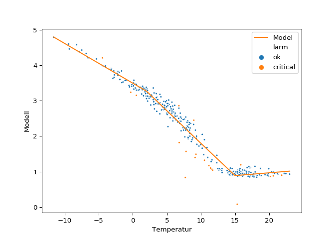

K2 has proven to be an effective way at detecting anomalies in district
heating. However, one of the caveats of K2 is the need of a reference
period. The algorithm behind the K2 software, built by Smart Energi,
first trains a segmented regression model on a reference period, which
is a subset of the data that we want to investigate. In the next step it
applies that model to all the data and compares the model on the
reference period to the new data. If the new values deviate too much
from the expected values, the algorithm classifies it as a anomaly and
creates an alarm.

The crux is that this reference period has to be manually selected, and
if you have a couple of thousand metering points this task is
impossible. Often users will use a specific year in the data as the
reference period, for all metering points. If they get too many alarms
because of a bad reference period they’ll manually pick a new reference
period. There is also a feature in K2 which calculates the standard
deviation of district heating consumption for each year and picks the
year with least spread.

The manual selection of reference period can be a tedious job.
Therefore, we would like to investigate if we actually need a reference
period. That is, what will happen if we instead of using a reference
period fit a model to the whole data set and then calculate the
deviation?

What do we want to detect?
--------------------------

The two primary objectives of K2 are to 1) detect anomalies and create
alarms for these and 2) detect trend changes.

Anomalies are detected when new observations deviate too much from their
expected values. There is no explicit method for detecting trend changes
in K2. Nevertheless, trend changes are usually associated with some kind
of data drift, that is, that the new unseen data is different than the
reference period. This is usually detected when there are more alarms
than usual which indicate a drift in the new data compared to the
reference period.

The algorithm used in K2 is thoroughly described here. But we can have a
look at the model and how it fits to the reference data below.

    ## <matplotlib.axes._subplots.AxesSubplot object at 0x120a33ba8>

If we apply this regression line to the dataset we get the following
alarms.

    ## temp_intervall  group  property 
    ## (-100, 2]       1      not-known    0.105717
    ## (2, 9]          1      not-known    0.218645
    ## (9, 15]         1      not-known    0.180127
    ## (15, 20]        1      not-known    0.116806
    ## (20, 100]       1      not-known    0.042927
    ## Name: stdav, dtype: float64

    ## <matplotlib.axes._subplots.AxesSubplot object at 0x10e4e00f0>

But if we abandon the idea of a reference period, and instead treat both
the reference data and the test data as one dataset, fit a segmented
regression on in similar fashion investigate the residuals, how will
that change the alarms?

First, we can visually inspect the observations for the whole period.
The periods are alike but the reference period has a different signature
during the warm days, which actually is the cause of the alarms created
in the plot above.

So, let’s fit a segmented regression to this data.

    ## <matplotlib.axes._subplots.AxesSubplot object at 0x1204b9080>

How do the alarms look?

    ## temp_intervall  group  property 
    ## (-100, 2]       1      not-known    0.105717
    ## (2, 9]          1      not-known    0.218645
    ## (9, 15]         1      not-known    0.180127
    ## (15, 20]        1      not-known    0.116806
    ## (20, 100]       1      not-known    0.042927
    ## Name: stdav, dtype: float64

    ## <matplotlib.axes._subplots.AxesSubplot object at 0x1232ff828>

For this case, the difference between fitting the model on reference
data compared to all the data is small. In reality, it would make more
sense to fit the model to the whole data set in this case.

Why do we use a reference period?
---------------------------------

Nevertheless, this metering point is by no means representative for all
metering points in a district heating network. For instance, if a
metering point has a lot of anomalies and we try to fit a model to the
data it might get confused and it will cause an overwhelming number of
alarms. This will happen if we use a reference period as well, but the
reference period gives the user the possibility to adjust which data to
compare new observations against.

So the answer is partly that, yes, in K2 it makes sense to use a
reference period. However, it is not necessarily so that we need to use
a reference period for all metering points.

The reference period is used today mainly as a data quality tool. If the
quality of data is poor, i.e. there are lots of missing values, a whole
year with anomalies or other peculiarities that exist in a district
heating network; this will create a large amount of alarms which will
force the K2 user to change reference period to a more suitable time
period. Perhaps a different approach would be to first do a data quality
check to and then try to find deviations.

In a later post we’ll investigate what happens when we skip the
reference period for a larger amount of metering points.
